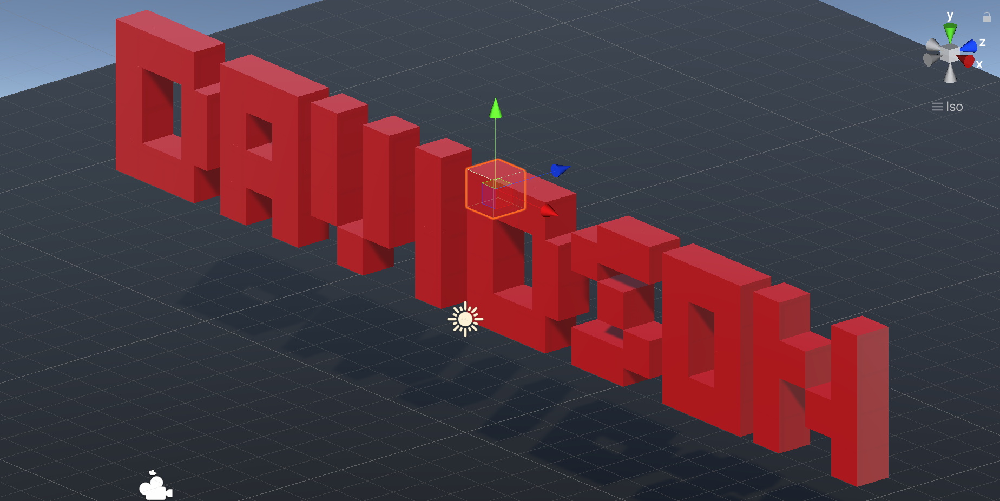
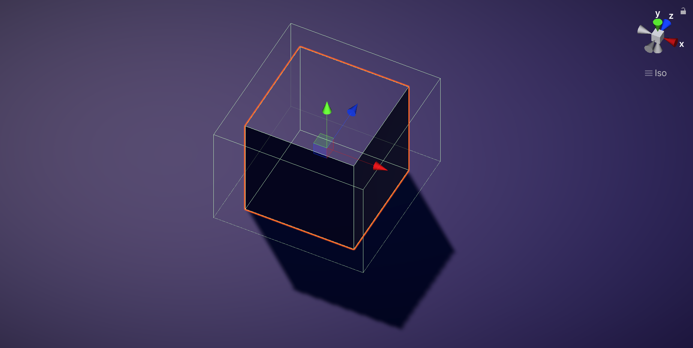

# Sample Unity Physics

A sample Unity (2020.1.2f1) project that shows

- Essential physics concepts in Unity
- [C# inheritance](https://learn.unity.com/tutorial/inheritance) with base and child classes
- Basic use of the URP (Universal Render Pipeline)

## HelloDavidson

A Hello World! for basic physics in game engines. Just press play!

## PhysicsBasic

Examples of common methods for moving GameObjects in Unity. See the class reference sheets on movement with [transform.position](https://github.com/omundy/dig250-game-art-dev/blob/master/reference-sheets/Unity-Vectors) and [physics](https://github.com/omundy/dig250-game-art-dev/blob/master/reference-sheets/Unity-Physics.md) for more details.

- CubesTranslate
    - Four examples using `transform.Translate()` to "teleport" GameObject position.
    - Controlling transform directly is fine for simple movement but all physics interactions (collisions, etc.) will not work as expected.
- CubesMovePosition
    - Four examples using `Rigidbody.MovePosition()`
    - This method manipulates `transform.position` inside `FixedUpdate()`, but calculates collision (mostly) along the way.
- CubesAddforce
    - Four examples using `AddForce()`.

## Unity Physics Resources

See these tutorials for more on Unity and Physics

- [Unity Movement Vectors](https://github.com/omundy/dig250-game-art-dev/blob/master/reference-sheets/Unity-Movement-Vectors) and [Unity Movement Physics](https://github.com/omundy/dig250-game-art-dev/blob/master/reference-sheets/Unity-Movement-Physics.md) reference sheets
- [Move in Unity3D - Ultimate Unity Tutorial](https://www.youtube.com/watch?v=fyV77lN1Yl0&ab_channel=JasonWeimann) (49:23)
- [Unity Movement [RigidBody vs Translate]](https://www.youtube.com/watch?v=ixM2W2tPn6c&ab_channel=PressStart) (10:30)
- [How to add Force correctly | Unity Physics 101 (1/3)](https://www.youtube.com/watch?v=BNiAt0HnC5M) (10:30)

## URP (Universal Render Pipeline)

You can create a URP project using an option inside Unity Hub. When [converting from legacy rendering](https://docs.unity3d.com/Packages/com.unity.render-pipelines.universal@7.1/manual/InstallURPIntoAProject.html) to URP:

- Install URP Package
- Create URP asset and add to graphics settings
- Camera - Check rendering settings
- Scene - Use Lighting Settings
- Ensure all your materials use [URP shaders](https://docs.unity3d.com/Packages/com.unity.render-pipelines.universal@7.1/manual/upgrading-your-shaders.html)
